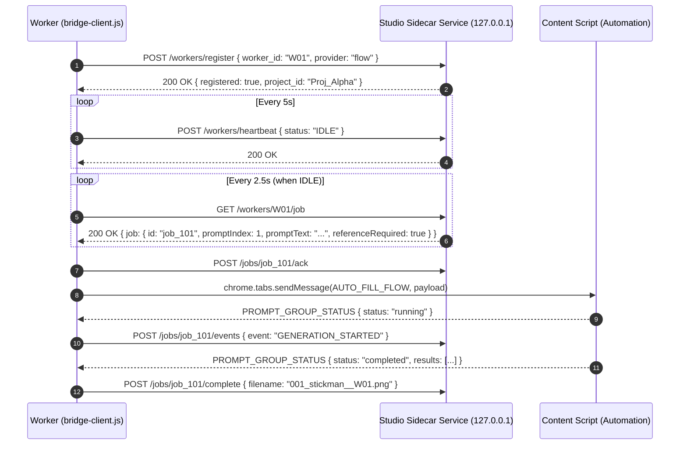
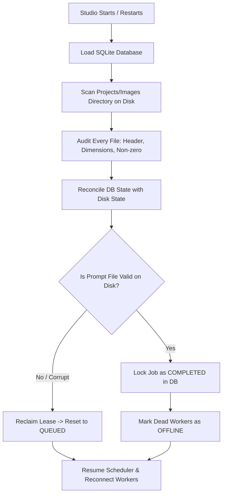

# STICKMAN STUDIO — ARCHITECTURE & IMPLEMENTATION REPORT
**Document Version:** 1.0.0  
**Target Platform:** Windows 10/11 Desktop (Local-First)  
**System Architecture:** Tauri 2 (Rust Core) + React / TypeScript / Tailwind (UI) + Node.js/TypeScript Local Sidecar Service + SQLite + Bundled FFmpeg  
**Target Hardware Baseline:** Intel Core i5 (6th Gen), 8 GB RAM, 4 GB GPU  

---

## EXECUTIVE SUMMARY & ARCHITECTURAL FOUNDATION

Stickman Studio is a local-first, professional desktop production engine designed to automate the entire lifecycle of 2D Stickman documentary video creation:
$$\text{Script / Prompts} \longrightarrow \text{Browser Workers (Flow + Meta)} \longrightarrow \text{Image Ingestion} \longrightarrow \text{Timeline Sync} \longrightarrow \text{Post-Production} \longrightarrow \text{1080p MP4}$$

### Core Tenet: Preservation of Proven Automation
The two existing Manifest V3 Chrome extensions—**Flow Automation** (`extensions/veo-automation-with Mbmirza`) and **Meta Automation** (`extensions/meta automation`)—are production-proven generation engines. They already solve complex provider-specific challenges: prompt input handling, generation monitoring, DOM mutation observation, queue management, downloads, delays, and worker identification (`worker-config.js`). 

**Absolute Architectural Law:** We do **NOT** build a third standalone Bridge extension, nor do we rewrite the working generation logic inside the existing extensions. Instead, a lightweight, non-intrusive `bridge-client.js` module is embedded directly inside each extension. The extensions communicate with the local Stickman Studio orchestration service via versioned HTTP endpoints on `localhost` (`http://127.0.0.1:45450/api/v1/`).

```
+-------------------------------------------------------------------------------------------+
|                                    STICKMAN STUDIO                                        |
|  +--------------------+   +---------------------+   +----------------------------------+  |
|  | Tauri 2 UI (React) |<->| SQLite Project DB   |<->| Node.js Local Sidecar Orchestrator |  |
|  +--------------------+   +---------------------+   +----------------------------------+  |
+-------------------------------------------------------------------|-----------------------+
                                                                    |
                                                      localhost HTTP REST Polling
                                                                    |
                                        +---------------------------+---------------------------+
                                        |                                                       |
                                        v                                                       v
                 +--------------------------------------+            +--------------------------------------+
                 |         FLOW WORKER INSTANCE         |            |         META WORKER INSTANCE         |
                 |  +--------------------------------+  |            |  +--------------------------------+  |
                 |  | Chrome Profile: Workers/Worker-01|  |            |  | Chrome Profile: Workers/Worker-06|  |
                 |  | +----------------------------+ |  |            |  | +----------------------------+ |  |
                 |  | | Existing Flow Automation   | |  |            |  | | Existing Meta Automation   | |  |
                 |  | | - worker-config.js (W01)   | |  |            |  | | - worker-config.js (W06)   | |  |
                 |  | | - bridge-client.js [NEW]   | |  |            |  | | - bridge-client.js [NEW]   | |  |
                 |  | +----------------------------+ |  |            |  | +----------------------------+ |  |
                 |  +--------------------------------+  |            |  +--------------------------------+  |
                 +--------------------------------------+            +--------------------------------------+
```

---

## SECTION 1: WHAT EACH EXISTING EXTENSION CURRENTLY DOES

Detailed architectural inspection of the workspace code reveals the following exact mechanics for both extensions:

| Dimension | Meta AI Extension (`meta automation`) | Google Flow / Veo Extension (`veo-automation`) |
| :--- | :--- | :--- |
| **Manifest Version** | Manifest V3 (`manifest_version: 3`), Version `2.2.3.0` | Manifest V3 (`manifest_version: 3`), Version `3.5.2.0` |
| **Permissions** | `storage`, `tabs`, `sidePanel`, `activeTab`, `downloads` | `storage`, `unlimitedStorage`, `tabs`, `sidePanel`, `activeTab`, `downloads`, `debugger`, `cookies` |
| **Service Worker** | `service-worker-loader.js` $\rightarrow$ `assets/index.ts-BqblPwcc.js` | `service-worker-loader.js` $\rightarrow$ `assets/index.ts-BNvXgTH3.js` |
| **Content Script** | `assets/index.ts-BdeTBz9V.js` on `*://*.meta.ai/*` | `assets/index.ts-loader-BNP0wsxk.js` $\rightarrow$ `assets/index.ts-D1zBd6hg.js` on `*://flow.google.com/*` |
| **Side Panel UI** | `src/ui/side-panel/index.html` loading `assets/index.html-Cb5LKqTn.js` | `src/ui/side-panel/index.html` loading `assets/index.html-Brqyon0Y.js` |
| **Prompt Dispatch** | Side panel sends `AUTO_FILL_META` via `chrome.tabs.sendMessage` | Side panel sends `AUTO_FILL_FLOW` via `chrome.tabs.sendMessage` |
| **Prompt Submission** | Direct DOM input into Meta AI chat box, button click | Uses Chrome DevTools Protocol (`chrome.debugger`) `CIT` (Input.insertText), `CK` (KeyEvent), `CC` (Click) |
| **Generation Tracking** | DOM polling for `fbcdn` image element completion and message IDs | DOM polling for generated cards, video/image URLs, progress status |
| **File Download** | Sends `DOWNLOAD_RESOURCE` to service worker; downloads via `chrome.downloads.download` | Sends `DOWNLOAD_RESOURCE` / `DOWNLOAD_VIDEO` to service worker; downloads via `chrome.downloads` |
| **Worker Identifier** | Imports `worker-config.js` (`export const WORKER_ID = "W01";`); appends `__W01` to filename | Imports `worker-config.js` (`export const WORKER_ID = "W01";`); appends `__W01` to filename |
| **Output Naming** | `{folderName}/{promptIndex}_{promptText}__{workerId}.jpg` | `{folderName}/{promptIndex}_{promptText}{suffix}__{workerId}.png` |
| **Image Pre-upload** | Listens for `PREPARE_IMAGE` / `PREPARE_IMAGE_CHUNK` storing into `z[id]` | Intercepts input clicks via `catchUploadFile.ts-DJwIizxX.js` with `VEO_UPLOAD_FILE_DATA` event; stores into `oe[id]` |
| **Status Telemetry** | Emits `PROMPT_GROUP_STATUS` containing status, processedCount, totalCount, results | Emits `PROMPT_GROUP_STATUS` containing status, processedCount, totalCount, results |

---

## SECTION 2: WHERE BRIDGE CLIENT CAN BE SAFELY INSERTED

The Bridge Client is an internal communication adapter. To ensure zero disruption to the existing UI and logic:

1. **Host Environment:** `bridge-client.js` resides inside the extension root directory.
2. **Execution Context:** The Bridge Client runs in the **Side Panel** or **Background Service Worker** environment (Side Panel is preferred for persistent HTTP network access and direct DOM/Tab orchestration without MV3 service worker premature termination).
3. **Integration Point with Automation Engine:**
   - Instead of a human pasting prompts into the Side Panel textarea and clicking "Start", `bridge-client.js` queries `GET /api/v1/workers/:id/job`.
   - When a job is received, `bridge-client.js` constructs the exact same `AUTO_FILL_META` or `AUTO_FILL_FLOW` payload structure that the side panel currently emits and sends it via `chrome.tabs.sendMessage(targetTabId, payload)`.
4. **Telemetry Capture:**
   - `bridge-client.js` subscribes to the existing `chrome.runtime.onMessage` bus, listening for `PROMPT_GROUP_STATUS`.
   - When status updates occur (`completed`, `error`, `cancelled`), `bridge-client.js` translates them into `POST /api/v1/jobs/:id/complete` or `POST /api/v1/jobs/:id/fail`.

---

## SECTION 3: EXACT FILES NEEDING MODIFICATION

We maintain a strict minimal-diff policy. The modifications needed are:

### In `extensions/meta automation/`:
1. `worker-config.js`:
   - Add backend connection config:
     ```javascript
     export const WORKER_ID = "W01";
     export const STUDIO_ENDPOINT = "http://127.0.0.1:45450/api/v1";
     ```
2. `bridge-client.js` (NEW FILE):
   - Handles polling, heartbeat, job dispatch, and reporting to Studio.
3. `manifest.json`:
   - Add `"bridge-client.js"` to `web_accessible_resources.resources`.
4. `src/ui/side-panel/index.html`:
   - Add `<script type="module" src="../../../bridge-client.js"></script>` at the end of body.

### In `extensions/veo-automation-with Mbmirza/`:
1. `worker-config.js`:
   - Add backend connection config:
     ```javascript
     export const WORKER_ID = "W01";
     export const STUDIO_ENDPOINT = "http://127.0.0.1:45450/api/v1";
     ```
2. `bridge-client.js` (NEW FILE):
   - Identical architectural client with provider-specific message mapping (`AUTO_FILL_FLOW`).
3. `manifest.json`:
   - Add `"bridge-client.js"` to `web_accessible_resources.resources`.
4. `src/ui/side-panel/index.html`:
   - Add `<script type="module" src="../../../bridge-client.js"></script>` at the end of body.

**Zero minified code rewrite:** Neither `assets/index.ts-BdeTBz9V.js` nor `assets/index.ts-D1zBd6hg.js` need to be decompiled or refactored. The existing message hooks are completely sufficient.

---

## SECTION 4: HOW WORKER ID WILL BE PRESERVED

1. **Source of Truth:** `worker-config.js` remains the sole local identifier:
   ```javascript
   export const WORKER_ID = "W01";
   ```
2. **Packaging / Deployment:** When Stickman Studio provisions browser worker profiles (`Workers/Worker-01/`, `Workers/Worker-02/`, etc.), it writes the designated `worker-config.js` into that profile's extension folder prior to Chrome launch.
3. **Runtime Provenance:**
   - The content script already reads `WORKER_ID` to stamp every downloaded image: `001_stickman_running__W01.png`.
   - The Bridge Client imports `WORKER_ID` from `./worker-config.js` and includes it in all HTTP headers: `X-Worker-ID: W01`.
   - Studio logs and database entries attribute every job, error, and timestamp to that `worker_id`.

---

## SECTION 5: HOW LOCALHOST COMMUNICATION WILL WORK

### Network Configuration
- **Host:** `127.0.0.1` (IPv4 loopback only; prevents external network exposure).
- **Default Port:** `45450` (configurable if occupied).
- **Protocol:** HTTP REST with JSON payloads.
- **Local Security Token:** On application boot, Studio generates an ephemeral cryptographic authentication token saved to a local runtime file. Extensions include this token in the `Authorization: Bearer <TOKEN>` header.

### API Contract (`/api/v1/`)
- `POST /api/v1/workers/register`: Worker startup announcement (sends worker ID, provider type, extension version).
- `POST /api/v1/workers/heartbeat`: Periodic health check (sends worker status, active tab URL, CPU/DOM health).
- `GET /api/v1/workers/:id/job`: Worker requests next assigned job chunk.
- `POST /api/v1/jobs/:id/ack`: Worker confirms receipt of job and intent to execute.
- `POST /api/v1/jobs/:id/events`: Telemetry event streaming (`PROMPT_SUBMITTED`, `GENERATION_DETECTED`, `DOWNLOAD_STARTED`).
- `POST /api/v1/jobs/:id/complete`: Worker reports successful batch generation and local download filenames.
- `POST /api/v1/jobs/:id/fail`: Worker reports generation failure with explicit error classification.
- `POST /api/v1/workers/:id/reference-state`: Syncs Character Reference initialization status (`NOT_READY`, `INITIALIZING`, `READY`, `ERROR`).
- `POST /api/v1/workers/:id/login-state`: Notifies Studio if login has expired (`LOGIN_REQUIRED`).

---

## SECTION 6: WORKER REGISTRATION, HEARTBEAT, AND JOB POLLING

### Ephemeral Context & Suspension Resilience
Manifest V3 service workers terminate after 30 seconds of inactivity. Therefore:
1. **Side Panel Dominance:** The Bridge Client executes within the extension's Side Panel context, which stays active as long as the side panel is open.
2. **Polling Loop Parameters:**
   - **Job Polling:** Every `2.5 seconds` when in `IDLE` state.
   - **Heartbeat:** Every `5.0 seconds` regardless of state.
3. **State Recovery on Browser Wakeup:**
   - If Chrome restarts or wakes from sleep, `bridge-client.js` immediately dispatches `POST /api/v1/workers/register`.
   - Studio responds with the worker's current assigned state and any active job lease, seamlessly resuming progress without re-running finished prompts.



---

## SECTION 7: HOW CHARACTER REFERENCE INITIALIZATION WORKS FOR FLOW

### Mechanism: Google Flow "Ingredients"
Google Flow provides an "Ingredients" reference image panel that conditions subsequent generation within a project session.
1. **DOM Hook via Existing Code:**
   - The Flow extension already includes `catchUploadFile.ts-DJwIizxX.js`, which overrides `HTMLInputElement.prototype.click` and listens for `VEO_UPLOAD_FILE_DATA`.
2. **Initialization Workflow:**
   - When a worker registers for a project, Studio checks if `WXX` has initialized the project's Character Reference (`character_id`, `version`).
   - If not initialized (`reference_status: NOT_READY`):
     1. Studio sends a `INITIALIZE_REFERENCE` task containing the reference image data (base64) and metadata.
     2. `bridge-client.js` opens/verifies the Flow project interface.
     3. Triggers the Flow "Add Ingredient / Reference Image" file selector.
     4. Dispatches the `VEO_UPLOAD_FILE_DATA` custom event containing the reference image base64.
     5. Verifies via DOM inspection that the Ingredient thumbnail is rendered.
     6. Reports `POST /api/v1/workers/:id/reference-state` $\rightarrow$ `READY`.
3. **Session Retention:** Once initialized, subsequent prompt jobs do **NOT** re-upload the image. Flow retains the Ingredient throughout the session.

---

## SECTION 8: HOW CHARACTER REFERENCE INITIALIZATION WORKS FOR META

### Mechanism: Meta AI Image Conditioning
Meta AI supports image attachment/prompt conditioning.
1. **DOM Hook via Existing Code:**
   - The Meta extension already contains image preparation logic in `assets/index.ts-BdeTBz9V.js` (`k` function, `PREPARE_IMAGE` message handler storing into `z[id]`).
2. **Initialization Workflow:**
   - Before prompt execution, `bridge-client.js` checks if the current Meta AI thread has the active character context established.
   - For a fresh session, Studio issues an `INITIALIZE_REFERENCE` payload.
   - The extension uploads the Character Reference image via `PREPARE_IMAGE` into the chat conversation input, establishing the visual anchor in the conversation history.
   - Once established, subsequent prompts within that conversation thread reference the character without re-uploading on every turn.
   - Reports `REFERENCE_READY` to Studio.

---

## SECTION 9: HOW REPAIR JOBS HANDLE REFERENCE CONTEXT

**Scenario:** Prompt `037` originally assigned to `W01` (Flow) times out or fails. The Repair Queue reassigns Prompt `037` to `W08` (Meta or another Flow worker).

### Mandatory Pre-Flight Verification:
1. **Context Inspection:** Before dispatching Prompt `037` to `W08`, Studio inspects `workers.reference_status` and `workers.active_character_version` for `W08`.
2. **Conditional Interception:**
   - If `W08` does not have `READY` status for the active character version:
     - Prompt `037` is held in `BLOCKED` status.
     - Studio immediately issues an `INITIALIZE_REFERENCE` job to `W08`.
     - `W08` initializes the character reference (Ingredients or Meta thread).
     - `W08` returns `REFERENCE_READY`.
3. **Execution:** Studio only now dispatches Prompt `037` to `W08`.
4. **Guarantee:** **A repair job will NEVER execute without verified character reference context.**

---

## SECTION 10: HOW STANDALONE FUNCTIONALITY REMAINS INTACT

The extensions must remain 100% usable as standalone tools when Stickman Studio is not running:
1. **Network Fault Tolerance:**
   - All `fetch()` calls to `http://127.0.0.1:45450` in `bridge-client.js` are wrapped in guarded `try / catch` blocks.
   - If `fetch()` rejects (e.g. `ERR_CONNECTION_REFUSED`), `bridge-client.js` enters a silent `STANDALONE_DORMANT` state.
   - It will poll with exponential backoff (up to 30s) without throwing unhandled exceptions or showing blocking UI dialogs.
2. **Manual UI Preservation:**
   - The Side Panel textarea, "Start", "Pause", and settings inputs remain completely functional.
   - If a user opens Chrome manually without Studio, they can paste prompts and run generations exactly as they did before the Bridge was added.

---

## SECTION 11: HOW BROWSER PROFILES WILL BE MANAGED

Each worker runs in a strictly isolated, persistent Chromium user profile:

```
StickmanStudioData/
  Workers/
    Worker-01/ (Persistent Profile: Cookies, Session, LocalStorage for Flow Account 1)
    Worker-02/ (Persistent Profile: Cookies, Session, LocalStorage for Flow Account 2)
    Worker-06/ (Persistent Profile: Cookies, Session, LocalStorage for Meta Account 1)
```

1. **Launch Command Line:**
   Studio spawns Chrome processes using:
   ```cmd
   chrome.exe --user-data-dir="C:\Users\Ali\AppData\Local\StickmanStudio\Workers\Worker-01" --profile-directory="Default" --no-first-run --no-default-browser-check "https://flow.google.com"
   ```
2. **Single-User Login:**
   - The user logs in to their provider account once per profile.
   - Session cookies and tokens persist indefinitely in that worker's profile directory.
3. **Login Expiry Protocol:**
   - If a provider redirects to login (e.g. accounts.google.com), the extension detects DOM authentication markers and reports `POST /api/v1/workers/:id/login-state` with `status: LOGIN_REQUIRED`.
   - Studio immediately halts job dispatch to that specific worker, updates the UI to show `WXX: Login Required`, and displays a one-click "Focus Browser" button.
   - Once the user logs in, the worker detects the logged-in DOM, reports `READY`, re-verifies reference state, and resumes automatically.

---

## SECTION 12: HOW FIXED PROMPT RANGES WILL BE ASSIGNED

Studio v1 adopts **Deterministic Fixed-Range Allocation**:

### Formula
For $N$ total prompts and $W$ configured active workers:
$$\text{Base Chunk Size} = \lfloor N / W \rfloor, \quad \text{Remainder} = N \pmod W$$
- Workers $1 \dots \text{Remainder}$ receive $\text{Base Chunk Size} + 1$ prompts.
- Workers $(\text{Remainder} + 1) \dots W$ receive $\text{Base Chunk Size}$ prompts.

### Example: 500 Prompts Across 5 Flow ($W01-W05$) + 5 Meta ($W06-W10$)
- `W01` (Flow): Prompts `001 – 050`
- `W02` (Flow): Prompts `051 – 100`
- `W03` (Flow): Prompts `101 – 150`
- `W04` (Flow): Prompts `151 – 200`
- `W05` (Flow): Prompts `201 – 250`
- `W06` (Meta): Prompts `251 – 300`
- `W07` (Meta): Prompts `301 – 350`
- `W08` (Meta): Prompts `351 – 400`
- `W09` (Meta): Prompts `401 – 450`
- `W10` (Meta): Prompts `451 – 500`

Prompts are delivered sequentially within each worker's range.

---

## SECTION 13: HOW MISSING/FAILED PROMPTS WILL BE REPAIRED

1. **Detection Mechanisms:**
   - **Worker Failure Report:** Worker reports failure via `POST /jobs/:id/fail` after exhausting local retries (default: 3).
   - **Lease Expiration:** Worker goes offline or fails to send heartbeat for > 30 seconds while holding a job lease.
   - **Post-Batch Scan:** File audit discovers gaps (e.g., received `001-072`, `074-151`; missing `073`, `152`).
2. **The Repair Queue:**
   - Missing/failed prompt IDs are placed into a high-priority `Repair Queue`.
   - The Repair Queue does **NOT** reset or restart the batch.
   - As any worker finishes its assigned range and becomes `IDLE`, Studio assigns jobs from the Repair Queue.
   - The worker executes the pre-flight character reference check (Section 9) before generating the repair prompt.

---

## SECTION 14: HOW CRASH RECOVERY WILL WORK

If Studio crashes, Chrome crashes, or power is cut:



1. **State Persistence:** SQLite stores every project, prompt, job lease, and file mapping with write-ahead logging (WAL).
2. **On Studio Startup:**
   - Reads the database.
   - Performs a disk scan of `Projects/<Name>/images/`.
   - Reconciles DB records against actual files on disk.
   - Cleans up stale in-flight leases (`lease_expires_at < NOW()`).
   - Any completed, validated files remain `COMPLETED`.
   - Incomplete or corrupted jobs return to `QUEUED` / `Repair Queue`.
   - Browser workers re-register and pick up exactly where they left off.

---

## SECTION 15: HOW COMPLETED JOBS WILL NEVER BE ACCIDENTALLY REGENERATED

**Strict Idempotency Rule:** Generation is expensive and irreversible. 

### Multi-Tiered Validation Barrier:
1. **File Integrity Verification:**
   - File exists on disk.
   - File size $> 10 \text{ KB}$ (guards against 0-byte corrupt downloads).
   - Image decodes successfully as valid PNG/JPEG.
   - Image dimensions match required aspect ratio (e.g. 1920x1080 or 16:9).
2. **Database Permanent Lock:**
   - Once validated, the prompt record is updated: `status = 'COMPLETED'`, `file_path = '...'`, `sha256 = '...'`.
3. **Dispatcher Guarantee:**
   - The job dispatcher query is strictly bounded:
     ```sql
     SELECT * FROM prompts 
     WHERE project_id = ? AND status NOT IN ('COMPLETED', 'LOCKED')
     ```
   - Studio will **NEVER** re-issue a job for a completed prompt unless the user explicitly right-clicks and triggers "Force Regenerate Prompt".

---

## SECTION 16: PHASE 0 VALIDATION TESTS BEFORE FULL IMPLEMENTATION

Before assembling the full desktop application, the following empirical tests must be completed:

| Test ID | Test Name | Objective & Pass Criteria |
| :---: | :--- | :--- |
| **Test A** | **Groq Script Analysis & Prompting** | Run Groq (`openai/gpt-oss-120b`) on a 60–90 second script (concrete + abstract). Verify adherence to Stickman visual rules and exact calculated prompt count. |
| **Test B** | **Cross-Provider Character Consistency** | Supply the exact same Character Reference image to Flow and Meta with identical prompt text. Evaluate line weight, body proportions, and visual style coherence. Determine whether single-video cross-provider mixing is aesthetically viable or if single-provider per video is required. |
| **Test C** | **Reference Session Retention** | Initialize Character Reference once on a Flow worker $\rightarrow$ run 20 sequential prompts $\rightarrow$ verify character persists without re-uploading $\rightarrow$ simulate repair reassignment to a second worker $\rightarrow$ verify second worker initializes reference prior to repair job. |
| **Test D** | **Worker Concurrency Hardware Load Test** | Benchmark the user's specific development hardware (i5 6th Gen, 8 GB RAM, 4 GB GPU). Run 2 concurrent worker profiles $\rightarrow$ monitor CPU/RAM $\rightarrow$ scale to 3 $\rightarrow$ evaluate 5. Establish safe operating thresholds and UI resource warning triggers. |
| **Test E** | **Extension Standalone Regression Test** | Verify that with Stickman Studio completely terminated/offline, both Flow and Meta extensions operate normally in manual mode with zero console errors or UI blocks. |
| **Test F** | **Bridge Polling & Reconnection Test** | Simulate Studio service termination while workers are active. Verify that extensions back off gracefully and automatically re-register and resume jobs upon Studio relaunch. |
| **Test G** | **FFmpeg Baseline Render Test** | Stitch 20 sample 1080p stickman images + voiceover MP3 + 7% background music into a clean H.264/AAC 1080p MP4. Verify audio sync and render stability. |

---

## SECTION 17: REAL CONFLICTS AND AMBIGUITIES FOUND IN THE WORKSPACE

Our deep inspection identified three critical discrepancies across the workspace documentation that must be resolved:

### Conflict 1: Master Prompt Hard-Coded Formula (`0.75`) vs. Studio Configurable Pacing

- **The Conflict:**
  In `input master prompt...SCRIPT_TO_IMAGE_PROMPT_MASTER_V7_STICKMAN_LOCKED.md` (lines 111, 871, 1016), the document explicitly commands:
  ```text
  TOTAL IMAGES = TOTAL VOICE-OVER SECONDS x 0.75
  This formula is LOCKED. Never change the formula.
  ```
  However, `GPT.md`, `CLAUDE.md`, and the user's master directive explicitly dictate that Stickman Studio must provide configurable pacing presets:
  - `1 / 4 sec` ($0.25$ images/sec)
  - `2 / 4 sec` ($0.50$ images/sec — **Locked Default**)
  - `3 / 4 sec` ($0.75$ images/sec — Historical formula)
  - `4 / 4 sec` ($1.00$ images/sec)
  - `5 / 4 sec` ($1.25$ images/sec)
  - `Custom`
- **Architectural Resolution:**
  The AI prompt generator must **NOT** calculate image count internally using the old `0.75` hard-lock. Instead, **Stickman Studio's deterministic TypeScript engine calculates the exact target image count** before any prompt generation begins:
  $$\text{target\_image\_count} = \text{Math.round}(\text{voiceover\_seconds} \times \text{pacing\_multiplier})$$
  The Master Prompt template used by Studio will have a dynamic parameter injected:
  ```text
  TARGET IMAGE COUNT (PRE-CALCULATED BY STUDIO): EXACTLY [TARGET_IMAGE_COUNT] PROMPTS.
  Do not recalculate using historical formulas. Generate exactly [TARGET_IMAGE_COUNT] sequential prompt blocks.
  ```

### Conflict 2: Markdown Prompt Output Format (Clean Prompts vs. Metadata Blocks)
- **The Conflict:**
  Some historical drafts contained structured metadata headers (`IMAGE 001`, `Timestamp: 00:04`, `Visual Purpose: Narrative setup`, `Prompt: ...`).
- **Architectural Resolution:**
  As locked in `CLAUDE.md` and the user directive, Mode 2 parser strictly targets **clean sequential prompts only**:
  ```text
  001_stickman sitting at a wooden desk under a dim lamp...
  002_stickman standing up abruptly, pointing at a whiteboard...
  ```
  All metadata (scene IDs, timestamps, character mappings) is tracked internally within the SQLite database, never polluting the prompt generation string.

### Conflict 3: Hardware Reality vs. High Worker Counts
- **The Reality:**
  The target machine has **8 GB RAM** and an **Intel Core i5 (6th Gen)**. A single Chromium browser instance with active rendering can consume 600 MB to 1 GB RAM. Running 10 simultaneous browser instances would risk exhausting physical RAM and causing severe disk thrashing / Windows paging.
- **Architectural Resolution:**
  Studio will support any user-configured worker count (e.g. 5 Flow + 5 Meta), but includes a real-time system resource monitor. If available RAM drops below 1.5 GB, Studio displays a non-blocking warning recommending 2 to 3 workers for optimal stability on the current machine, without forcing a change to the user's configuration.

---

## IMPLEMENTATION PHASES & ROADMAP

```text
+---------------------------------------------------------------------------------------+
| PHASE 0: Empirical Validation Lab (Tests A–G: Concurrency, Bridge, Flow/Meta QA)     |
+---------------------------------------------------------------------------------------+
                                           |
                                           v
+---------------------------------------------------------------------------------------+
| PHASE 1: Desktop Application Foundation (Tauri 2 + React + SQLite + Sidecar Service)  |
+---------------------------------------------------------------------------------------+
                                           |
                                           v
+---------------------------------------------------------------------------------------+
| PHASE 2: Bridge Clients & Worker Orchestrator (Polling, Ranges, Repair Queue, Leases) |
+---------------------------------------------------------------------------------------+
                                           |
                                           v
+---------------------------------------------------------------------------------------+
| PHASE 3: Image Ingestion, Validation & Master Voiceover Timeline                      |
+---------------------------------------------------------------------------------------+
                                           |
                                           v
+---------------------------------------------------------------------------------------+
| PHASE 4: Post-Production & Video Assembly (Captions, SFX, Music 7%, FFmpeg 1080p MP4)  |
+---------------------------------------------------------------------------------------+
                                           |
                                           v
+---------------------------------------------------------------------------------------+
| PHASE 5: Mode 1 AI Story Engine (Groq Multi-Key + Dynamic Pacing Master Prompt)       |
+---------------------------------------------------------------------------------------+
```

### Immediate Next Step
Await user review and approval of this architectural plan. Upon approval, proceed to execute **Phase 0 Validation Lab** (benchmarking Groq prompt outputs and 2-worker concurrent browser communication) before scaffold construction.
