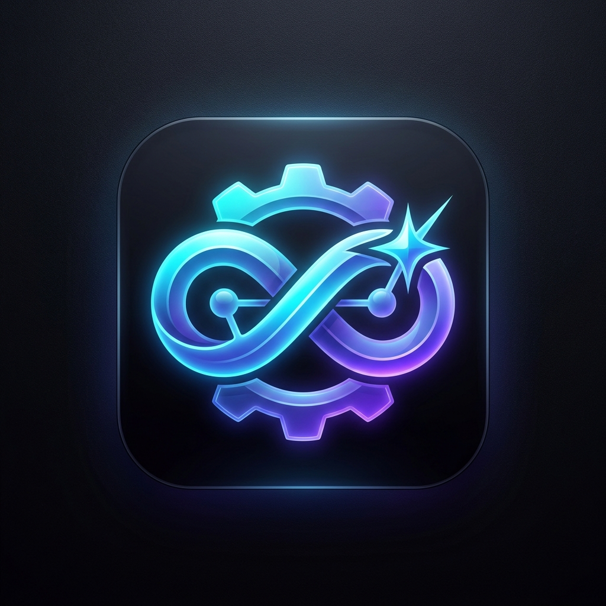
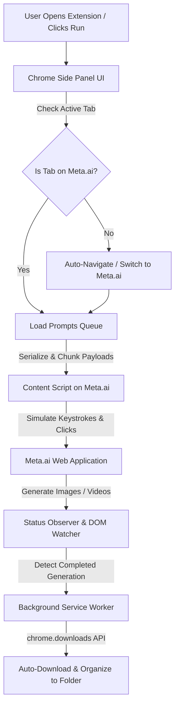

<p align="center">
  
</p>

<h1 align="center">⚡ Meta Automation - Auto Meta on Meta.ai</h1>

<p align="center">
  <strong>Scale your creative workflow with automated batch prompts, image & video generation, and hands-free media downloads on Meta.ai.</strong>
</p>

<p align="center">
  <a href="https://github.com/abidalidevv"></a>
  <a href="https://developer.chrome.com/docs/extensions/mv3/intro/"></a>
  <a href="https://abidalidev.com"></a>
  <a href="https://ko-fi.com/abidalidev"></a>
  
</p>

---

## 🌟 Overview

**Meta Automation** is an autonomous browser extension for [Meta.ai](https://www.meta.ai), engineered to batch generate AI images and videos at scale without manual copy-pasting.

Operating directly inside the **Chrome Side Panel**, it handles prompt queues, simulates organic human input, monitors generation lifecycles, and automatically downloads and organizes generated media into designated folders.

---

## 🚀 What's New in v2.2.3

- **⚡ Instant One-Click Launch**: Clicking the extension icon or the **Run** button automatically brings you directly to `https://www.meta.ai/`—no manual navigation required.
- **🎯 Default Mode: Text to Image**: Streamlined default settings set to **Text to Image** with **1 Concurrent Prompt** and **1 Output per Prompt** for immediate high-quality creation.
- **🛡️ Auto-Recovery & Resilient Handshake**: Eliminates blocking overlays with proactive tab detection and automated switching.

---

## 📁 Repository & File Structure

```text
meta-automation/
├── manifest.json                  # Manifest V3 extension configuration & permissions
├── service-worker-loader.js       # Root background service worker loader
├── logo.png                       # High-resolution extension brand logo
├── LICENSE                        # MIT Open Source License
├── README.md                      # Comprehensive documentation & guides
├── assets/
│   ├── index.ts-BqblPwcc.js       # Background Service Worker (download listener, tab routing)
│   ├── index.ts-BdeTBz9V.js       # Content Script (DOM automation & Meta.ai communication)
│   ├── index.html-Cb5LKqTn.js     # Side Panel App Engine (Vue 3, State, Queue Manager)
│   ├── index-L954q1Jy.css         # Modern Indigo/Dark Theme styling & animations
│   ├── remoteConfig-Bo9zmBo3.js   # Remote / Local fallback configuration module
│   └── primeicons-*               # UI icon font bundles (woff2, ttf, svg, eot)
└── src/
    ├── assets/                    # Extension action icons (16, 24, 32, 48, 128px)
    └── ui/
        └── side-panel/
            └── index.html         # Chrome Side Panel UI host document
```

---

## ⚙️ How It Works (Kaam Kaise Karta Hai)

The extension operates across three decoupled layers working in harmony:



1. **Auto-Navigation & Tab Verification**:
   - When opened or triggered, the extension queries active tabs.
   - If you are not on Meta AI, it automatically detects any existing `meta.ai` tab and switches to it, or opens a new tab navigating to `https://www.meta.ai/`.
2. **Payload Serialization & Communication**:
   - Prompts and settings (aspect ratio, duration, model) are packaged into structured JSON payloads.
   - Large image data or prompts are chunked (1MB blocks) through `chrome.tabs.sendMessage` to prevent IPC memory limits.
3. **Organic DOM Simulation**:
   - The content script injects inputs into Meta AI's native textarea using standard synthetic keyboard and clipboard events.
   - Randomized delays (jitter) mimic organic human actions, preventing rate-limiting.
4. **Lifecycle Tracking & Auto-Download**:
   - Watches Meta AI's generation status (`generating` ➔ `completed`).
   - Hooks into `chrome.downloads.onDeterminingFilename` to rename files and route them into custom subfolders.

---

## 📝 How Prompts are Handled (Prompts Handling Engine)

Meta Automation includes a prompt processing pipeline:

### 1. Input Formatting & Delimiters
- **Multi-line format**: Paste one prompt per line.
- **Spreadsheet / CSV import**: Import columns of prompts directly.
- **Sequential Indexing**: Every prompt is assigned an internal `promptIndex` for order preservation.

### 2. Concurrency & Queuing
- **Concurrent Prompts**: Set how many prompts to run at the same time (Default: `1`).
- **Sequential Execution**: Prompts run in FIFO (First-In, First-Out) order. Once Prompt 1 finishes, Prompt 2 begins automatically.
- **Delay Jitter**: Configurable minimum and maximum pause (e.g. `2s – 8s`) between prompts to avoid anti-bot detection.

### 3. Generation Modes
| Mode | Input | Output | Primary Use Case |
| :--- | :--- | :--- | :--- |
| **Text to Image** *(Default)* | Text prompt | 1–4 Images | Bulk concept art, thumbnails, social graphics |
| **Text to Video** | Text prompt | 5s Video clip | Dynamic video animations from scratch |
| **Image to Video** | Seed image + prompt | Animated clip | Breathing life into static photos |
| **Image to Image** | Reference images | Transformed art | Style transfer, variations, and upscale |

### 4. Smart Auto-Download & Routing
- Files captured directly from Meta's CDN (`fbcdn.net`).
- Supports `.mp4`, `.png`, `.jpg`, `.webp`.
- Automatically prepends prefix and folder paths (e.g., `meta-folder-1/01_prompt_name.png`).

---

## 📥 Installation

1. **Clone or Download Repository**:
   ```bash
   git clone https://github.com/abidalidevv/Meta-Automation-Auto-Meta-on-Meta.ai.git
   ```
2. **Load into Browser**:
   - Go to `chrome://extensions/` in Chrome / Brave / Edge.
   - Toggle **Developer mode** (top-right).
   - Click **Load unpacked** (top-left) and select the `meta automation` folder.
3. **Pin & Open**:
   - Pin the **Meta Automation** icon to your toolbar and click it to open the Side Panel.

---

## 🛠️ Step-by-Step Usage Guide

1. **Open Extension**:
   - Click the extension icon. It automatically opens the side panel and navigates to [Meta.ai](https://www.meta.ai).
   - Ensure you are signed in to your Meta account.
2. **Choose Mode & Enter Prompts**:
   - Select **Text to Image** (or your desired mode).
   - Type or paste your prompt list in the input area.
   - Adjust aspect ratio (`16:9`, `9:16`, `1:1`, etc.).
3. **Configure Settings**:
   - Under Settings:
     - **Default Mode**: `Text to Image`
     - **Concurrent Prompts**: `1`
     - **Outputs per prompt**: `1`
     - **Download Folder**: `meta-folder-1`
4. **Hit Run**:
   - Click the **Run** button.
   - Watch the real-time progress bar while the extension generates and downloads everything automatically.

---

## 👨‍💻 Author & Developer

Developed and maintained with ❤️ by **Abid Ali Dev**:

- 🌐 **Website**: [abidalidev.com](https://abidalidev.com)
- 💻 **GitHub**: [@abidalidevv](https://github.com/abidalidevv)
- 💼 **LinkedIn**: [in/abidalidev](https://linkedin.com/in/abidalidev)
- 🐦 **X (Twitter)**: [@abidalidevv](https://x.com/abidalidevv)
- 📸 **Instagram**: [@abidalidevv](https://www.instagram.com/abidalidevv)
- 📘 **Facebook**: [abidalidevv](https://www.facebook.com/abidalidevv)
- ☕ **Support on Ko-fi**: [ko-fi.com/abidalidev](https://ko-fi.com/abidalidev)
- 📍 **Location**: Punjab, Pakistan
- 📧 **Email**: [abidmmp99@gmail.com](mailto:abidmmp99@gmail.com)

---

## ⚖️ License

Distributed under the **MIT License**. See `LICENSE` for details.
