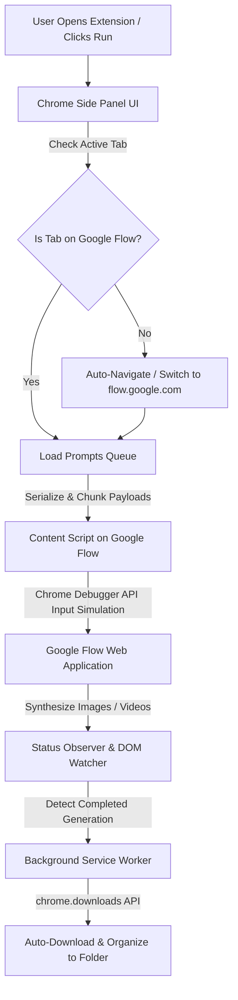

<p align="center">
  
</p>

<h1 align="center">✨ Test-to-Image & Veo Flow Automation Chrome Extension</h1>

<p align="center">
  <strong>High-speed autonomous batch prompt generator, Text-to-Image & Video synthesis, and automated high-res downloader for Google Flow & Veo.</strong>
</p>

<p align="center">
  <a href="https://github.com/abidalidevv/Test-to-image-Chrome-extention"></a>
  <a href="https://developer.chrome.com/docs/extensions/mv3/intro/"></a>
  <a href="https://abidalidev.com"></a>
  <a href="https://ko-fi.com/abidalidev"></a>
  
</p>

---

## 🌟 Overview

**Test-to-Image & Veo Flow Automation** is an autonomous browser extension for [Google Flow](https://flow.google.com) and **Google Veo**. It transforms manual prompt submission into a fully automated, scalable production pipeline.

Operating directly inside the **Chrome Side Panel**, it manages batch prompt queues, injects organic input keystrokes, tracks rendering lifecycles, and automatically downloads and organizes generated media into designated folders.

---

## 🚀 What's New in v3.5.2

- **⚡ Instant One-Click Launch**: Clicking the extension icon or the **Run** button automatically navigates or switches you directly to `https://flow.google.com/`—no manual navigation needed.
- **🎯 Default Mode: Text to Image**: Settings preset to **Text to Image** with **1 Concurrent Prompt** and **1 Output per Prompt** for optimal stability and generation speed.
- **🛡️ Silent Background Automation**: Suppresses repetitive "Unusual Activity" prompts by default (`hideTipBeforeUse: true`) for distraction-free generation.
- **🔄 Smart Tab Handshake**: Proactively discovers existing Google Flow tabs or creates new ones without displaying blocking warning overlays.

---

## 📁 Repository & File Structure

```text
veo-automation-with-Mbmirza/
├── manifest.json                  # Manifest V3 extension configuration & permissions
├── service-worker-loader.js       # Background service worker loader
├── logo.png                       # Extension brand logo
├── LICENSE                        # MIT Open Source License
├── README.md                      # Comprehensive documentation & guides
├── assets/
│   ├── index.ts-BNvXgTH3.js       # Service Worker (Debugger API, cookie cleaner, download router)
│   ├── index.ts-loader-BNP0wsxk.js# Content Script loader for flow.google.com
│   ├── index.ts-D1zBd6hg.js       # Content Script core (DOM observer & event dispatcher)
│   ├── index.html-Brqyon0Y.js     # Side Panel App Engine (Vue 3, State, Queue Manager)
│   ├── index-DR4wMqUa.css         # Modern Cyber-Cyan/Dark Theme styling & animations
│   ├── utils-D8jN6fhl.js          # Shared utility functions and DOM helpers
│   ├── catchUploadFile.ts-DJwIizxX.js # Media upload interceptor and bridge
│   ├── remoteConfig-MBhMtTF0.js   # Remote & local fallback configuration module
│   └── primeicons-*               # UI icon font bundles (woff2, ttf, svg, eot)
└── src/
    ├── assets/                    # Action icons (16, 24, 32, 48, 128px)
    └── ui/
        └── side-panel/
            └── index.html         # Chrome Side Panel UI host document
```

---

## ⚙️ How It Works (Kaam Kaise Karta Hai)

The extension architecture uses a multi-tier automation pipeline:



1. **Auto-Navigation & Tab Verification**:
   - When opened or triggered, the extension checks if the active tab is on `flow.google.com`.
   - If not, it finds an existing Google Flow tab and focuses it, or opens a new tab navigating to `https://flow.google.com/`.
2. **Payload Serialization & Communication**:
   - Prompts, aspect ratio, duration, and model parameters are packaged into structured JSON payloads.
   - Large image data or prompts are chunked (1MB blocks) through `chrome.tabs.sendMessage` to avoid memory limits.
3. **Chrome Debugger & Synthetic Input**:
   - Uses native Chrome Debugger API commands (`Input.insertText`, `Input.dispatchKeyEvent`) and synthetic clipboard events to simulate human typing in Google Flow's interface.
   - Configurable randomized delays between prompts prevent bot-detection flags.
4. **Lifecycle Tracking & Auto-Download**:
   - Continuously monitors Google Flow's generation status.
   - When media is ready, hooks into `chrome.downloads.onDeterminingFilename` to automatically rename files and route them into custom subfolders.

---

## 📝 How Prompts are Handled (Prompts Handling Engine)

### 1. Input Formatting & Delimiters
- **Multi-line format**: Paste one prompt per line.
- **Spreadsheet / CSV import**: Import columns of prompts directly.
- **Sequential Indexing**: Every prompt is assigned an internal `promptIndex` to preserve execution sequence.

### 2. Concurrency & Queuing
- **Concurrent Prompts**: Default set to `1` for reliable execution on Google Flow.
- **Sequential Execution**: Prompts run in FIFO (First-In, First-Out) order. Once Prompt 1 finishes, Prompt 2 begins automatically.
- **Delay Jitter**: Configurable pause between prompts (e.g. `0s – 20s`) to simulate organic human typing.

### 3. Generation Modes
| Mode | Input | Output | Primary Use Case |
| :--- | :--- | :--- | :--- |
| **Text to Image** *(Default)* | Text prompt | 1 Output | Concept art, thumbnails, high-res assets |
| **Text to Video** | Text prompt | Video clip (8s+) | Cinematic video sequences with camera control |
| **Image to Video** | Seed image + prompt | Animated clip | Animate still images with fluid motion |
| **Components to Video** | Seed images + elements | Cohesive scene | Multi-asset video composition |
| **Agent Automation** | Text / Image prompts | Multi-modal outputs | Automated agent-driven generation pipeline |

### 4. Smart Auto-Download & Routing
- Captures finished outputs directly from Google CDN.
- Supports `.mp4`, `.png`, `.jpg`, `.webp`.
- Automatically prepends prefix and folder paths (e.g., `veo-folder-1/01_prompt_name.png`).

---

## 📥 Installation

1. **Clone or Download Repository**:
   ```bash
   git clone https://github.com/abidalidevv/Test-to-image-Chrome-extention.git
   ```
2. **Load into Browser**:
   - Go to `chrome://extensions/` in Chrome / Brave / Edge.
   - Toggle **Developer mode** (top-right).
   - Click **Load unpacked** (top-left) and select the `veo-automation-with Mbmirza` folder.
3. **Pin & Open**:
   - Pin the **Veo Flow Automation** icon to your toolbar and click it to open the Side Panel.

---

## 🛠️ Step-by-Step Usage Guide

1. **Open Extension**:
   - Click the extension icon. It automatically opens the side panel and navigates to [Google Flow](https://flow.google.com).
   - Ensure you are logged into your Google account.
2. **Choose Mode & Enter Prompts**:
   - Select **Text to Image** (or your desired mode).
   - Type or paste your prompt list in the input area.
   - Adjust aspect ratio (`16:9`, `9:16`, etc.).
3. **Configure Settings**:
   - Under Settings:
     - **Default Mode**: `Text to Image`
     - **Concurrent Prompts**: `1`
     - **Outputs per prompt**: `1`
     - **Download Folder**: `veo-folder-1`
4. **Hit Run**:
   - Click the **Run** button.
   - Watch the real-time progress bar while the extension generates and downloads everything hands-free.

---

## 👨‍💻 Author & Developer

Developed and maintained with ❤️ by **Abid Ali Dev**:

- 🌐 **Website**: [abidalidev.com](https://abidalidev.com)
- 💻 **GitHub**: [@abidalidevv](https://github.com/abidalidevv)
- 💼 **LinkedIn**: [in/abidalidev](https://linkedin.com/in/abidalidev)
- 🐦 **X (Twitter)**: [@abidalidevv](https://x.com/abidalidevv)
- 📸 **Instagram**: [@abidalidevv](https://www.instagram.com/abidalidevv)
- 📘 **Facebook**: [abidalidevv](https://www.facebook.com/abidalidevv)
- ☕ **Support on Ko-fi**: [ko-fi.com/abidalidev](https://ko-fi.com/abidalidev)
- 📍 **Location**: Punjab, Pakistan
- 📧 **Email**: [abidmmp99@gmail.com](mailto:abidmmp99@gmail.com)

---

## ⚖️ License

Distributed under the **MIT License**. See `LICENSE` for details.
